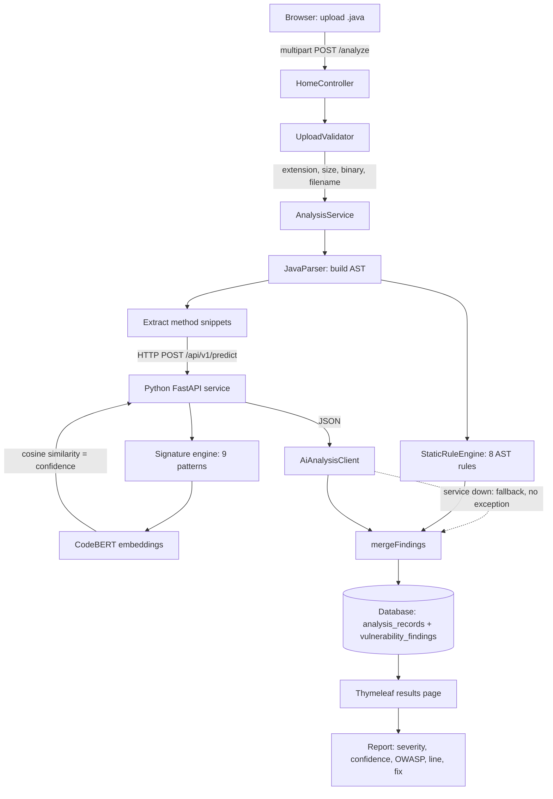

# DevSentinel

**AI-Powered Java Vulnerability Detection System**

Upload a `.java` file through a web UI. DevSentinel parses it into an Abstract
Syntax Tree, runs an explainable security rule engine over that tree, layers
CodeBERT semantic scoring on top to produce confidence values, persists the
result, and renders a report with severities, OWASP mappings, line numbers, and
concrete fixes.

Built as a final-year B.Tech project. Spring Boot + Thymeleaf on one side,
FastAPI + Hugging Face Transformers on the other.

---

## Table of Contents

- [Overview](#overview)
- [Problem Statement](#problem-statement)
- [Features](#features)
- [Architecture](#architecture)
- [Vulnerabilities Detected](#vulnerabilities-detected)
- [AI Architecture — read this before your viva](#ai-architecture--read-this-before-your-viva)
- [Future ML Enhancement](#future-ml-enhancement)
- [Tech Stack](#tech-stack)
- [Project Structure](#project-structure)
- [Prerequisites](#prerequisites)
- [Installation](#installation)
- [Running](#running)
- [Troubleshooting mvn errors](#troubleshooting-mvn-errors)
- [Testing](#testing)
- [Worked Example](#worked-example)
- [AI Degraded Mode](#ai-degraded-mode)
- [Database](#database)
- [Configuration](#configuration)
- [Security Practices](#security-practices)
- [Limitations](#limitations)
- [Future Scope](#future-scope)
- [Viva Questions](#viva-questions)

---

## Overview

DevSentinel is a static application security testing (SAST) tool for Java, with
a machine-learning layer bolted onto a deterministic rule engine.

The flow, end to end:

```
Java file  ->  upload  ->  JavaParser AST  ->  rule engine  ->  AI confidence
           ->  merge    ->  database       ->  Thymeleaf report
```

Two processes cooperate:

| Process | Language | Responsibility |
|---|---|---|
| Web application | Java 17 / Spring Boot 3 | Upload, AST parsing, rule engine, persistence, UI |
| AI service | Python 3.10+ / FastAPI | Signature matching + CodeBERT semantic confidence |

They communicate over plain HTTP JSON. The Java side never depends on the
Python side being alive — see [AI Degraded Mode](#ai-degraded-mode).

---

## Problem Statement

Most Java security bugs are not exotic. They are the same handful of mistakes,
repeated: a query built with `+` instead of a bind parameter, a password pasted
into a constant, `MessageDigest.getInstance("MD5")` copied from a 2009 blog
post, a `catch` block left empty to silence a compiler warning.

These are cheap to find automatically and expensive to find in production.
Commercial SAST tools do this well but are costly and opaque. Student projects
that claim to do it with "AI" usually cannot explain what the model actually
decided.

DevSentinel takes the opposite approach: **every finding is explainable**. A
deterministic rule says *why* something was flagged, and the ML layer adds a
calibrated confidence score rather than being the thing that makes the call.

---

## Features

- Web-based `.java` upload with validation (extension, size, binary content,
  path-traversal-safe filenames)
- AST-based detection via JavaParser — accurate line numbers and method names,
  not regex guesses over raw text
- **8 static rules** running inside the JVM with no network dependency
- **9 signature classes** in the Python AI service, with CodeBERT semantic
  confidence scoring
- Intelligent merge: when both engines find the same issue in the same method,
  it is reported **once**, tagged `STATIC+AI`, keeping the exact static line
  number and the AI confidence
- Severity bands (CRITICAL / HIGH / MEDIUM / LOW), OWASP Top 10 2021 mapping,
  and a 0–100 weighted risk score
- Concrete remediation code for every finding
- **Graceful degradation** — the AI service can be killed mid-demo and analysis
  continues on static rules, clearly labelled `DEGRADED`
- Full persistence with a browsable History page and an H2 console
- JSON API alongside the UI (`/api/v1/analyze`, `/api/v1/status`)
- Zero-install database by default (H2 file); PostgreSQL via a profile switch

---

## Architecture



### Why the work is split across two processes

JavaParser gives a real AST — method boundaries, catch clauses, binary
expressions, literal values — which is fast, deterministic, and produces exact
line numbers. The Hugging Face ecosystem is Python-native and painful to run
inside the JVM. Each language does what it is good at.

The split also produces the resilience story: because the AI layer is a
*separate process reached over HTTP*, its failure is a network event the Java
side can catch, rather than a crash inside the analyser.

### How results are merged

`AnalysisService.mergeFindings()` implements this rule:

- A static finding and an AI finding with the **same vulnerability type inside
  the same method line range** are the same issue. They collapse into one
  finding, `detectionSource = STATIC+AI`, keeping the static line number
  (exact) and the AI confidence (more informative).
- An AI finding with no static counterpart is added on its own
  (`detectionSource = AI`), attributed to the method's start line.
- Findings are sorted most-severe-first, then by line number.

---

## Vulnerabilities Detected

| Type | Severity | OWASP 2021 | Static rule | AI signature |
|---|---|---|---|---|
| `SQL_INJECTION` | CRITICAL | A03 Injection | yes | yes |
| `COMMAND_INJECTION` | CRITICAL | A03 Injection | yes | yes |
| `HARDCODED_SECRET` | HIGH | A07 Auth Failures | yes | yes |
| `WEAK_CRYPTOGRAPHY` | HIGH | A02 Cryptographic Failures | yes | yes |
| `PATH_TRAVERSAL` | HIGH | A01 Broken Access Control | yes | yes |
| `EMPTY_CATCH_BLOCK` | MEDIUM | A09 Logging Failures | yes | yes |
| `RESOURCE_LEAK` | MEDIUM | — | yes | yes |
| `NULL_POINTER_RISK` | MEDIUM | — | — | yes |
| `STRING_CONCAT_IN_LOOP` | LOW | — | yes | yes |

Eight of the nine are detected by the JVM-side rule engine, which is why
degraded mode still produces a useful report.

### Two detection details worth knowing

**SQL injection is detected on the AST, not with a regex.** An earlier
regex-based version broke on the most common real-world shape, because the SQL
string itself contains quotes:

```java
stmt.executeQuery("SELECT * FROM users WHERE name='" + name + "'");
```

The current rule looks for a `BinaryExpr` with operator `PLUS` containing SQL
keywords, passed to a known execution method — quotes inside the literal are
irrelevant. Both shapes are covered: concatenation inline in the call, and
concatenation assigned to a variable first. There is a regression test for each.

**Hardcoded secrets match camelCase names.** The rule pattern is
`\w*(password|passwd|pwd|secret|api_?key|token|credential)\w*`, so `dbPassword`
and `apiKeyValue` match, not just an exact word. To keep false positives down it
checks the *variable declarator* rather than raw file text, requires a string
literal initialiser of at least 4 characters, and skips obvious placeholders
(`changeme`, `null`, `${...}`, `<...>`) and values loaded from
`System.getenv(...)`.

---

## AI Architecture — read this before your viva

**`microsoft/codebert-base` is a base encoder. It is not a vulnerability
classifier, and this project does not pretend otherwise.**

CodeBERT was pretrained with masked-language-modelling and
replaced-token-detection objectives on code and natural language. It has **no
classification head trained on vulnerability labels**. Feeding it Java and
asking "is this vulnerable?" is not a thing the base model can do.

So DevSentinel separates two jobs that are often conflated:

| Job | Handled by | Output |
|---|---|---|
| **What is wrong, and how serious** | Explainable signature/rule engine | vulnerability type, severity, OWASP category, remediation |
| **How confident are we this match is meaningful** | CodeBERT embeddings | a 0.0–1.0 confidence score |

Concretely, in `ai-engine/app/analyzer.py`:

1. Each `Signature` carries a `semantic_anchor` — a plain-English description
   of the weakness, e.g. *"building a SQL query by concatenating untrusted user
   input into a string"*.
2. When a signature's regex matches, CodeBERT embeds both the code snippet and
   that anchor text (mean-pooled over the last hidden state).
3. Cosine similarity between the two embeddings, mapped from `[-1, 1]` to
   `[0, 1]`, becomes the reported **confidence**.
4. If the Java static pass sent a matching hint, confidence gets a +0.15 bonus,
   capped at 1.0 — two independent methods agreeing is genuine evidence.

If the transformer cannot be loaded, confidence falls back to a neutral `0.5`
and `modelVersion` is reported as `"rule-only"` — the service never claims
CodeBERT ran when it did not. There is a test asserting exactly this
(`test_rule_only_mode_reports_model_version`).

**The honest one-sentence summary for your viva:** *"I use a deterministic rule
engine to decide what the vulnerability is, and CodeBERT embeddings to score how
semantically consistent the flagged code is with a description of that
weakness — it is a confidence layer, not a classifier."*

---

## Future ML Enhancement

The seam for a real classifier is marked in `ai-engine/app/analyzer.py` at the
bottom of the file. Replacing the confidence layer with a trained classifier
means:

1. **Pick a labelled dataset.**
   - [Devign](https://sites.google.com/view/devign) — function-level
     vulnerable/not labels from real C projects
   - [Big-Vul](https://github.com/ZeoVan/MSR_20_Code_vulnerability_CSV_Dataset) —
     CVE-linked functions with CWE labels
   - [NIST Juliet Java Test Suite](https://samate.nist.gov/SARD/test-suites) —
     synthetic but genuinely Java and CWE-labelled, the most directly usable
     of the three for this project

2. **Swap the model class.** `AutoModel` becomes
   `AutoModelForSequenceClassification` with `num_labels` = number of CWE
   classes plus a "clean" class.

3. **Fine-tune.** Tokenise to 512 tokens, train 3–5 epochs with AdamW at
   `2e-5`, class weighting for the imbalance (clean code vastly outnumbers
   vulnerable code).

4. **Change `analyze()`** to return `argmax(softmax(logits))` as the
   vulnerability type, with the softmax probability as confidence — the shape
   sketched in the comment block at the end of `analyzer.py`.

The API contract does not change, so the Java side needs no modification. That
is the point of putting the seam there.

---

## Tech Stack

**Backend**
- Java 17, Spring Boot 3.3.4
- Spring MVC, Spring Data JPA (Hibernate 6)
- Spring WebFlux `WebClient` — non-blocking calls to the AI service
- JavaParser 3.26.1 — AST construction
- Lombok
- H2 (default) / PostgreSQL (profile)

**AI Service**
- Python 3.10+, FastAPI, Uvicorn
- Hugging Face Transformers, PyTorch
- Pydantic v2

**Frontend**
- Thymeleaf server-side templates, hand-written CSS
- No React, no npm, no build step

**Testing**
- JUnit 5, Mockito, AssertJ, MockWebServer, Spring MockMvc
- pytest, FastAPI TestClient

---

## Project Structure

```
devsentinel/
├── pom.xml
├── .gitignore
├── .env.example
├── README.md
├── db/
│   └── schema.sql                  # PostgreSQL DDL (optional; H2 auto-creates)
├── docs/
│   ├── ARCHITECTURE.md
│   └── VIVA-GUIDE.md
├── samples/
│   └── VulnerableExample.java      # demo file; triggers all 8 static rules
├── scripts/
│   ├── start-ai-service.bat/.sh
│   ├── start-app.bat/.sh
│   └── run-tests.bat/.sh
├── src/
│   ├── main/
│   │   ├── java/com/devsentinel/
│   │   │   ├── DevSentinelApplication.java
│   │   │   ├── client/AiAnalysisClient.java        # WebClient + fallback
│   │   │   ├── config/WebClientConfig.java
│   │   │   ├── controller/
│   │   │   │   ├── HomeController.java             # Thymeleaf routes
│   │   │   │   └── ApiController.java              # JSON API
│   │   │   ├── dto/
│   │   │   ├── exception/
│   │   │   ├── model/
│   │   │   │   ├── AnalysisRecord.java
│   │   │   │   └── VulnerabilityFinding.java
│   │   │   ├── repository/
│   │   │   └── service/
│   │   │       ├── AnalysisService.java            # orchestration + merge
│   │   │       ├── StaticRuleEngine.java           # 8 AST rules
│   │   │       ├── UploadValidator.java
│   │   │       └── VulnerabilityCatalog.java       # shared metadata
│   │   └── resources/
│   │       ├── application.properties
│   │       ├── application-postgres.properties
│   │       ├── static/css/style.css
│   │       └── templates/                          # layout, index, results, history, error
│   └── test/java/com/devsentinel/
│       ├── client/AiAnalysisClientTest.java        # degraded-mode contract
│       ├── controller/HomeControllerTest.java
│       └── service/
│           ├── StaticRuleEngineTest.java
│           ├── AnalysisServiceDegradedModeTest.java
│           ├── UploadValidatorTest.java
│           └── VulnerabilityCatalogTest.java
└── ai-engine/
    ├── main.py                     # FastAPI app
    ├── requirements.txt
    ├── app/
    │   ├── analyzer.py             # signatures + CodeBERT wrapper
    │   └── schemas.py              # Pydantic models (camelCase aliases)
    └── tests/
        ├── test_analyzer.py        # 16 rule tests
        └── test_api.py             # 12 endpoint tests
```

---

## Prerequisites

| Requirement | Version | Check with | Notes |
|---|---|---|---|
| JDK | 17 or newer | `java -version` | Temurin or Oracle both fine |
| Maven | 3.8+ | `mvn -version` | Or use your IDE's bundled Maven |
| Python | 3.10–3.12 | `python --version` | 3.13 may lack prebuilt torch wheels |
| pip | recent | `pip --version` | |
| Database | none required | | H2 is embedded; PostgreSQL optional |

Disk space: about **1.5 GB** if you let the CodeBERT model download
(~500 MB model + ~900 MB CPU-only PyTorch). See
[running without the model](#option-b-skip-the-model-download) if that is a
problem.

On Windows, make sure `java`, `mvn`, and `python` all work in a fresh
Command Prompt before continuing. If `mvn` is not recognised, add Maven's `bin`
folder to your PATH environment variable.

### Opening in IntelliJ IDEA

This is a standard single-module Maven project, so IntelliJ needs no special
configuration: **File → Open**, select the `devsentinel` folder (the one
containing `pom.xml`), and IntelliJ auto-detects it as a Maven project and
imports it. Confirm **File → Project Structure → SDK** is set to a JDK 17 or
newer. The `DevSentinelApplication` class shows a green run arrow in the
gutter once import finishes — that runs the same application as
`mvn spring-boot:run`. Test classes under `src/test/java` show the same arrow
per class or per method.

---

## Installation

```bash
git clone <your-repo-url>
cd devsentinel
```

Optionally create your env file. You can skip this — every value has a working
default:

```bash
# Windows
copy .env.example .env
# macOS / Linux
cp .env.example .env
```

### Python AI service

```bash
cd ai-engine
python -m venv .venv

# Windows
.venv\Scripts\activate
# macOS / Linux
source .venv/bin/activate

python -m pip install --upgrade pip

# Install the CPU-only torch build first — it is roughly 900 MB instead of
# the ~2.5 GB CUDA build, which you do not need unless you have an NVIDIA GPU.
pip install torch --index-url https://download.pytorch.org/whl/cpu

pip install -r requirements.txt
cd ..
```

### Java application

```bash
mvn clean install
```

The first Maven run downloads Spring Boot and its dependencies, which takes a
few minutes.

---

## Running

**Before your first `mvn` command, run the structure check.** This catches the
two most common setup problems — wrong working directory and a stray duplicate
project — before Maven gets a chance to produce a confusing error about them.

```bat
scripts\verify-structure.bat
```

It should print `RESULT: Structure looks correct.` If it prints any `[FAIL]`
line instead, fix what it names before continuing — see
[Troubleshooting](#troubleshooting-mvn-errors) below if you are unsure why.

You need **two terminals**. Start the AI service first.

### Terminal 1 — Python AI service

```bash
cd ai-engine

# Windows
.venv\Scripts\activate
# macOS / Linux
source .venv/bin/activate

uvicorn main:app --host 127.0.0.1 --port 8000
```

Wait for `Model loaded successfully.` before moving on. **The first run
downloads roughly 500 MB** of CodeBERT weights into your Hugging Face cache.
Subsequent runs start in seconds.

Verify: open <http://localhost:8000/health> — you want `"modelLoaded": true`.

#### Option B: skip the model download

If you are short on bandwidth, disk space, or time, run in rule-only mode. All
detection still works; confidence scores become a neutral `0.5`.

```bash
# Windows
set DEVSENTINEL_SKIP_MODEL=1
# macOS / Linux
export DEVSENTINEL_SKIP_MODEL=1

uvicorn main:app --host 127.0.0.1 --port 8000
```

### Terminal 2 — Spring Boot application

**Exact Windows sequence, run from the folder containing `pom.xml`:**

```bat
cd path\to\devsentinel
mvn clean test
mvn spring-boot:run
```

`mvn clean test` should report `Tests run: N, Failures: 0, Errors: 0` across
six test classes — not `No tests to run.` If you see the latter, stop and run
`scripts\verify-structure.bat`; do not proceed to `spring-boot:run` until the
structure check is clean.

`mvn spring-boot:run` should end with a Tomcat startup line
(`Tomcat started on port(s): 8080`), not
`Unable to find a suitable main class`. That error is fixed at the `pom.xml`
level in this project — `spring-boot-maven-plugin` is configured with an
explicit `<mainClass>com.devsentinel.DevSentinelApplication</mainClass>`, so it
cannot occur unless Maven is building a different `pom.xml` than the one in
this repository (see [Troubleshooting](#troubleshooting-mvn-errors)).

### Open the application

**<http://localhost:8080>**

Other useful URLs:

| URL | Purpose |
|---|---|
| <http://localhost:8080> | Upload page |
| <http://localhost:8080/history> | Past analyses (proves persistence) |
| <http://localhost:8080/api/v1/status> | JSON health of both halves |
| <http://localhost:8080/h2-console> | Browse the database directly |
| <http://localhost:8000/docs> | FastAPI interactive API docs |

**H2 console login** — JDBC URL `jdbc:h2:file:./data/devsentinel`,
user `sa`, password blank.

### Windows shortcut

Instead of the above, double-click, in order:

1. `scripts\verify-structure.bat` — confirms the project is intact
2. `scripts\start-ai-service.bat` — creates the venv on first run
3. `scripts\start-app.bat`

---

## Troubleshooting `mvn` errors

### `mvn test` says `No tests to run.`

This means Maven found `pom.xml` and compiled successfully, but discovered
zero files matching `**/*Test.java` under `src/test/java`. In this project
there are six:

```
src/test/java/com/devsentinel/client/AiAnalysisClientTest.java
src/test/java/com/devsentinel/controller/HomeControllerTest.java
src/test/java/com/devsentinel/service/AnalysisServiceDegradedModeTest.java
src/test/java/com/devsentinel/service/StaticRuleEngineTest.java
src/test/java/com/devsentinel/service/UploadValidatorTest.java
src/test/java/com/devsentinel/service/VulnerabilityCatalogTest.java
```

Run `scripts\verify-structure.bat` from the folder that contains `pom.xml`. If
it reports these files are missing, your extracted copy is incomplete or you
are pointed at a different folder than you think — re-extract the ZIP fresh
into a new empty folder and `cd` directly into the `devsentinel` folder that
contains `pom.xml`, then try again.

### `mvn spring-boot:run` says `Unable to find a suitable main class`

This happens when Spring Boot's plugin cannot decide which compiled class is
the entry point — either because no `@SpringBootApplication` class exists on
the classpath, or because more than one does. `pom.xml` in this project pins
the answer explicitly:

```xml
<mainClass>com.devsentinel.DevSentinelApplication</mainClass>
```

so this specific error should not be reachable from this `pom.xml`. If you
still see it: run `scripts\verify-structure.bat` — its "duplicate main-method
check" will tell you if more than one `main()` exists under `src/main/java`
(for example, if you merged files from an older copy of this project into a
newer one). Also check the "duplicate pom.xml check" in the same script output
— if Maven is picking up a *different* `pom.xml` than the one in this
repository (nested in a parent folder, or from an old extraction sitting
alongside this one), it will not have the `mainClass` fix above.

### Both errors together, `BUILD SUCCESS` shown

If you see both errors and Maven reports success in between, the project files
Maven is compiling are not the ones you think they are — almost always because
Maven ran from the wrong working directory, or an old extraction of this
project exists somewhere Maven is finding first. `verify-structure.bat` prints
its own working directory as its first line specifically so you can confirm
this.

---

## Testing

### Python

```bash
cd ai-engine
# Windows: .venv\Scripts\activate    macOS/Linux: source .venv/bin/activate

# Rule-only mode so the suite never triggers a 500 MB download
set DEVSENTINEL_SKIP_MODEL=1        # Windows
export DEVSENTINEL_SKIP_MODEL=1     # macOS / Linux

pytest tests/ -v
```

**Expected: 28 passed.** 16 analyzer/rule tests and 12 API contract tests. These
run offline in well under a second.

### Java

```bash
mvn clean test
```

`clean` matters here: it forces a fresh compile so a stale `target/` directory
from an earlier attempt can't mask the real result. There are 53 `@Test`
methods across the six classes, plus one `@ParameterizedTest` that runs 9
times (one per vulnerability type), for **62 total test executions**. Expect
output ending with something like:

```
[INFO] Tests run: 62, Failures: 0, Errors: 0, Skipped: 0
[INFO] BUILD SUCCESS
```

across the six test classes listed in
[Troubleshooting](#troubleshooting-mvn-errors). If you see `No tests to run.`
instead, that is a structure problem, not a test failure — go to
[Troubleshooting](#troubleshooting-mvn-errors) before assuming anything about
the tests themselves.

Coverage: the rule engine (SQL injection with embedded quotes, camelCase
secrets, and the negative cases that guard against over-matching), upload
validation, degraded-mode behaviour, the AI client's never-throw contract via
MockWebServer, and the MVC routes.

### Both at once

```bash
scripts\run-tests.bat     # Windows
./scripts/run-tests.sh    # macOS / Linux
```

---

## Worked Example

1. Start both services (above).
2. Open <http://localhost:8080>.
3. Upload `samples/VulnerableExample.java`.
4. Click **Analyse Code**.

That file is written to trigger every static rule. You should see findings
including:

| Method | Finding | Severity |
|---|---|---|
| `findUserByName` | SQL Injection | CRITICAL |
| `generateThumbnail` | OS Command Injection | CRITICAL |
| *(field)* `dbPassword`, `apiKey` | Hardcoded Credential | HIGH |
| `hashPassword` | Weak Cryptographic Algorithm (MD5) | HIGH |
| `readUserFile` | Path Traversal | HIGH |
| `readConfig` | Empty Catch Block + Unclosed Resource | MEDIUM |
| `buildCsv` | String Concatenation in Loop | LOW |
| `calculateTotal` | *(nothing — this method is clean)* | — |

Each finding shows the OWASP category, exact line number, the offending code,
a plain-English explanation, and a suggested fix.

Then open <http://localhost:8080/history> to confirm the run was saved, or check
the H2 console:

```sql
SELECT id, file_name, total_findings, risk_score, ai_engine_status
FROM analysis_records ORDER BY analysed_at DESC;
```

### Via the JSON API

```bash
curl -F "file=@samples/VulnerableExample.java" http://localhost:8080/api/v1/analyze
```

---

## AI Degraded Mode

**This is the most convincing thing you can demonstrate.** It shows the system
is engineered, not just assembled.

### What it does

If the Python service is stopped, unreachable, slow, or returns errors, the
Spring application does **not** fail. It:

1. Falls back to static rule analysis, which runs entirely inside the JVM
2. Records `ai_engine_status = 'DEGRADED'` on the analysis
3. Shows a red **AI Engine: DEGRADED / Static Analysis: Available** banner
4. Displays an explanatory notice on the results page
5. Still detects 8 of the 9 vulnerability classes

### How to demonstrate it

1. With both services running, upload the sample file. Note the green
   **ONLINE** banner and confidence values from CodeBERT.
2. Press **Ctrl+C** in the Python terminal.
3. Refresh <http://localhost:8080> — the banner turns red immediately.
4. Upload the same file again. **It still works.** Findings appear, labelled
   `DEGRADED`, with rule confidence instead of semantic confidence.
5. Open History — you can see one `SUCCESS` run and one `DEGRADED` run side by
   side.

### How it is implemented

`AiAnalysisClient` is written so it **never propagates a network failure**.
Every path ends in `.onErrorResume(...)` returning
`AiPredictResponse.offlineFallback()`. `AnalysisService` marks the run degraded
when every AI response for that file was a fallback.

This is covered by tests, not just documentation:
`AiAnalysisClientTest` uses MockWebServer to simulate HTTP 500, a dropped
connection, and a completely stopped server, asserting a fallback is returned in
each case. `AnalysisServiceDegradedModeTest` asserts that a fully-offline AI
service still yields static findings with `aiEngineStatus = DEGRADED` and that
no finding falsely claims AI attribution.

---

## Database

**Default: H2, file-based.** No installation. The database is created at
`./data/devsentinel.mv.db` on first startup and persists across restarts.
Hibernate generates the schema from the JPA entities
(`spring.jpa.hibernate.ddl-auto=update`).

Two tables:

- **`analysis_records`** — one row per analysed file: filename, size, SHA-256
  checksum, finding counts by severity, risk score, methods parsed,
  `ai_engine_status`, timestamp
- **`vulnerability_findings`** — one row per issue: type, display name,
  severity, category, OWASP category, file, method, line number, code snippet,
  description, remediation, confidence, detection source, timestamp

`db/schema.sql` contains the equivalent PostgreSQL DDL with constraints and
indexes, plus some ready-made verification queries.

### Using PostgreSQL instead

```bash
createdb devsentinel
psql -d devsentinel -f db/schema.sql     # optional; ddl-auto can do it

# Windows
set DB_PASSWORD=your-password
# macOS / Linux
export DB_PASSWORD=your-password

mvn spring-boot:run -Dspring-boot.run.profiles=postgres
```

---

## Configuration

Everything is environment-driven with sensible defaults. See `.env.example` for
the full list. The most useful:

| Variable | Default | Purpose |
|---|---|---|
| `SERVER_PORT` | `8080` | Change if 8080 is taken |
| `DB_USERNAME` / `DB_PASSWORD` | `sa` / empty | Database credentials |
| `AI_SERVICE_URL` | `http://localhost:8000` | Where the Python service lives |
| `AI_RESPONSE_TIMEOUT_SECONDS` | `20` | Per-snippet inference timeout |
| `AI_MAX_SNIPPETS` | `25` | Cap on snippets sent per file |
| `DEVSENTINEL_MODEL` | `microsoft/codebert-base` | Hugging Face model id |
| `DEVSENTINEL_SKIP_MODEL` | `0` | Set `1` for rule-only mode |
| `DEVSENTINEL_DEVICE` | `cpu` | Set `cuda` if you have an NVIDIA GPU |

**No real credentials are committed to this repository.** `.env` is gitignored;
only `.env.example` with placeholders is tracked.

---

## Security Practices

Appropriate for a security tool:

- **Uploaded code is never compiled or executed.** It is parsed and read as
  text only. There is no `Runtime.exec`, no reflection on user input, no
  dynamic class loading anywhere in the codebase.
- **Upload validation**: `.java` extension required, 1 MB size cap enforced at
  both the Spring multipart layer and in `UploadValidator`, NUL-byte scan to
  reject binaries, and a check for a Java type declaration.
- **Path traversal defence**: filenames containing `..`, `/`, or `\` are
  rejected before the name is logged or rendered.
- **XSS defence**: all uploaded code is rendered with Thymeleaf's `th:text`,
  which HTML-escapes. Uploaded source cannot inject markup into the report.
- **No secrets in the repo**: credentials come from environment variables;
  `.env`, `*.key`, and `*.pem` are gitignored.
- **No stack traces to users**: `server.error.include-stacktrace=never`, and
  `GlobalExceptionHandler` returns friendly messages while logging details
  server-side.
- **Bounded resource use**: capped snippet count per file, capped snippet
  length, connect/read timeouts on every outbound call.

---

## Limitations

Stated plainly, because your examiner will ask and honesty scores better than
overclaiming:

1. **CodeBERT is not fine-tuned for vulnerability classification.** It supplies
   semantic confidence, not verdicts. See
   [AI Architecture](#ai-architecture--read-this-before-your-viva).
2. **No data-flow or taint analysis.** The rules are structural. They see that
   a variable is concatenated into a query; they cannot prove the variable came
   from user input. This produces false positives on code where the value is a
   trusted constant.
3. **Single-file analysis.** No cross-file or cross-method tracking, no project
   or package-level view.
4. **Rule coverage is a subset of OWASP Top 10.** Five of the ten categories are
   represented. There is no detection for XXE, insecure deserialization, SSRF,
   or access-control logic flaws.
5. **The Python signature layer is regex-based** and works on snippet text, so
   it is less precise than the JVM-side AST rules. It can be fooled by unusual
   formatting.
6. **No authentication.** Anyone who can reach the port can upload. Deliberate —
   the brief called for a focused college project, not a multi-tenant service.
7. **Not a replacement for a real SAST tool.** SonarQube, Semgrep, and
   SpotBugs have years of rule engineering behind them.

---

## Future Scope

- Fine-tune a classifier on NIST Juliet (see
  [Future ML Enhancement](#future-ml-enhancement))
- Taint analysis using JavaParser's symbol solver to track user input from
  source to sink, which would remove most false positives
- Multi-file and full-project upload (ZIP or Git URL)
- More rule classes: XXE, insecure deserialization, SSRF, weak random, missing
  TLS verification
- Export reports as PDF or SARIF for CI integration
- A GitHub Action that runs DevSentinel on every pull request
- Rule-level suppression and a false-positive feedback loop that could later
  become training data

---

## Viva Questions

**What is DevSentinel?**
A static application security testing tool for Java with a machine-learning
confidence layer. You upload a `.java` file; it parses the file into an AST,
applies security rules to that tree, scores each match with CodeBERT embeddings,
saves everything to a database, and renders a report with severities, OWASP
mappings, line numbers, and suggested fixes.

**Why did you use JavaParser?**
Because regular expressions are the wrong tool for parsing code. I need to know
whether a `+` is inside a method call argument, whether a catch block is empty,
whether a `new File(...)` sits in a try-with-resources header. Those are
structural facts that only exist in an AST. JavaParser also gives exact line
numbers and enclosing method names for free. Concretely: my SQL injection rule
looks for a `BinaryExpr` with operator `PLUS` passed to `executeQuery`, which is
immune to quote characters inside the SQL string — a regex version of the same
rule broke on exactly that case.

**Why Spring Boot?**
It gives me the web layer, dependency injection, JPA persistence, multipart
upload handling, validation, and externalised configuration in one coherent
framework. And the JVM is where JavaParser lives, so the parsing work has to
happen in Java anyway.

**Why CodeBERT?**
It is pretrained on both code and natural language, which is exactly what I
need: I embed a Java snippet and an English description of a weakness in the
same vector space and measure how close they are. A model trained only on
natural language would not represent code well, and a model trained only on code
could not embed the English anchor text.

**Is CodeBERT fine-tuned?**
No, and I want to be clear about that. `microsoft/codebert-base` is a base
encoder with no classification head. It cannot decide whether code is
vulnerable. In my system the rule engine decides *what* the vulnerability is;
CodeBERT only scores *how semantically consistent* the flagged code is with a
description of that weakness. That score is the confidence value in the report.
I have marked the seam in `analyzer.py` where a fine-tuned
`AutoModelForSequenceClassification` would slot in, and the API contract would
not change.

**How does vulnerability detection actually work?**
Five steps. JavaParser builds the AST. Eight rule visitors walk that tree
looking for specific node shapes. In parallel the method bodies are sent to the
Python service, which matches nine text signatures and scores each match with
CodeBERT. The two result sets are merged — same type in the same method means
one finding, tagged `STATIC+AI`, keeping the static line number and the AI
confidence. Finally everything is persisted and rendered.

**How is SQL injection detected?**
I look for two shapes. First, a call to `executeQuery`, `executeUpdate`,
`execute`, `createQuery`, or `createNativeQuery` where an argument is a
`BinaryExpr` with operator `PLUS` whose text contains a SQL keyword. Second, a
local variable initialised to such a concatenation, since people often build the
query on one line and execute it on the next. Because I match on AST node types
rather than text, a quote inside the SQL literal — which is the most common real
shape, `WHERE name='" + name + "'` — does not break it. A `PreparedStatement`
with `?` placeholders is correctly not flagged, and there is a test for that.

**How are hardcoded secrets detected?**
I check variable *declarators*, not raw text. The variable name must match
`\w*(password|secret|api_?key|token|credential)\w*` — the `\w*` on both sides is
what makes `dbPassword` and `apiKeyValue` match, not just an exact word. The
initialiser must be a string literal of at least four characters. I then exclude
placeholders like `changeme` and `${...}`, and anything loaded from
`System.getenv(...)`. Checking the declarator rather than the file text is what
keeps false positives down — an unrelated string elsewhere in the file is never
flagged just because the word "password" appears nearby.

**What is the OWASP Top 10?**
A community-maintained list of the ten most critical web application security
risk categories, revised every few years; the current edition is 2021. It is a
prioritisation framework, not a checklist of bugs. DevSentinel maps findings to
five of the categories: A01 Broken Access Control (path traversal), A02
Cryptographic Failures (MD5, SHA-1, DES), A03 Injection (SQL and OS command),
A07 Identification and Authentication Failures (hardcoded credentials), and A09
Security Logging and Monitoring Failures (swallowed exceptions).

**What does confidence mean in your reports?**
It depends on the source, and the report tells you which. For a `STATIC`
finding it is a fixed per-rule confidence reflecting how precise that rule is —
an empty catch block is 0.95 because there is essentially no ambiguity, while a
possible null dereference is 0.60. For an `AI` finding it is the cosine
similarity between the CodeBERT embedding of the code and the embedding of the
weakness description, mapped to 0–1. For `STATIC+AI` it is the higher of the
two, because two independent methods agreeing is stronger evidence.

**What happens if the AI service goes down?**
Nothing breaks. `AiAnalysisClient` is written so it never propagates a network
failure — every path ends in `onErrorResume` returning a neutral fallback
object. The analysis continues using the static rules, which run entirely inside
the JVM, and the run is recorded as `DEGRADED`. The UI shows a red banner
reading "AI Engine: DEGRADED / Static Analysis: Available". Eight of the nine
vulnerability classes are still detected. I can demonstrate this live by
pressing Ctrl+C in the Python terminal and re-uploading the same file. It is
covered by tests using MockWebServer that simulate HTTP 500, a dropped
connection, and a fully stopped server.

**Why a separate Python service instead of doing everything in Java?**
Two reasons. Practically, the Hugging Face ecosystem is Python-native; running
transformers inside the JVM means DJL or ONNX conversion and a lot of friction.
Architecturally, putting the ML layer behind an HTTP boundary is what makes the
resilience story possible — because it is a separate process, its failure is a
network event my code can catch, rather than an exception inside my analyser. If
the model ran in-process, a model loading failure would take the whole
application down.

**Why Thymeleaf instead of React?**
Because the interesting part of this project is the analysis engine, not the
frontend. A React SPA would have meant a separate build pipeline, CORS
configuration, and client-side state management — days of work that would not
have improved the security analysis at all. Thymeleaf renders server-side, needs
no build step, and the whole UI is four templates and one CSS file.

**What are the limitations?**
The big one is no data-flow analysis: my rules see that a variable is
concatenated into a query, but cannot prove the value came from user input, so
trusted constants produce false positives. Beyond that: single-file only, no
cross-method tracking, five of ten OWASP categories covered, the Python
signature layer is regex-based and less precise than the AST rules, and CodeBERT
is not fine-tuned. It is a demonstration of the architecture, not a replacement
for SonarQube.

**How would you improve the ML component?**
Fine-tune on NIST Juliet, which is synthetic but genuinely Java and CWE-labelled.
That would turn the confidence layer into an actual classifier, capable of
catching variants my hand-written rules miss. I would also use the model to rank
findings by exploitability rather than just matching patterns, and eventually
collect user feedback on false positives as additional training data.

**How would you fine-tune CodeBERT?**
Swap `AutoModel` for `AutoModelForSequenceClassification` with `num_labels` set
to the number of CWE classes plus a clean class. Tokenise each function to 512
tokens, which is CodeBERT's positional limit. Train for three to five epochs
with AdamW at a learning rate of `2e-5`, using class weights because clean code
vastly outnumbers vulnerable code in any real dataset. Evaluate with precision,
recall, and F1 per class — accuracy is misleading on imbalanced data. Then
replace the body of `analyze()` to return the argmax of the softmax as the
vulnerability type and the probability as confidence. The JSON contract stays
identical, so the Java side needs no changes.

**How is the database used?**
Two tables via Spring Data JPA. `analysis_records` holds one row per analysed
file — filename, size, SHA-256 checksum, counts by severity, the weighted risk
score, and crucially `ai_engine_status`, which is how I can show a `SUCCESS` run
and a `DEGRADED` run side by side in the History page. `vulnerability_findings`
holds one row per issue with a foreign key back to the record, cascade delete,
and everything the report needs: type, severity, OWASP category, line number,
snippet, description, remediation, confidence, and detection source. H2 is the
default so the project runs with no database installation; PostgreSQL works by
activating a profile.

---

## Licence

MIT — see `LICENSE`. Educational project; do not use as your only security
control on production code.
